# Report 11

## 1

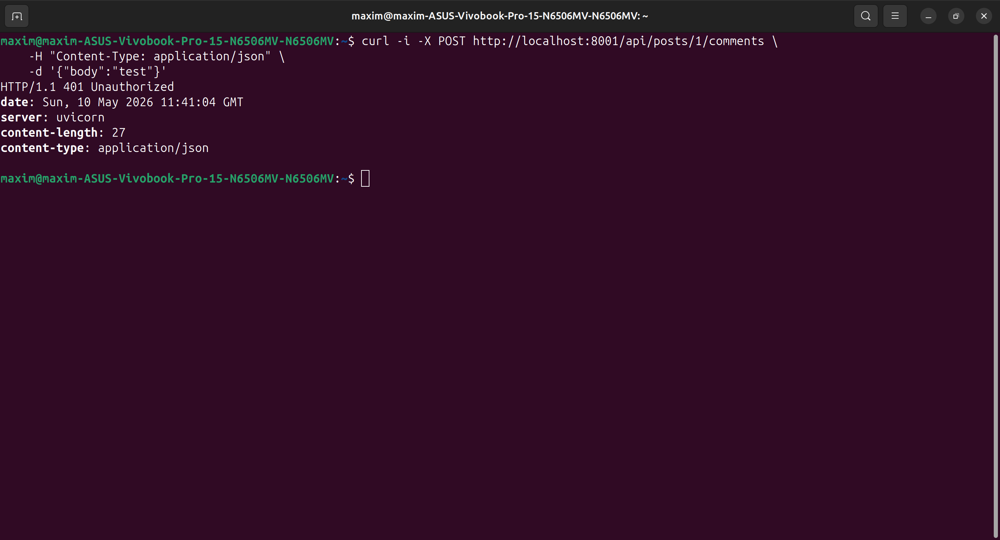

Bearer означает, что клиент предъявляет токен доступа. Сервер принимает запрос только если токен валиден.

Потому что Authorization поддерживает разные схемы авторизации: Basic, Digest, Bearer и другие. Слово
Bearer явно говорит серверу, как интерпретировать значение после пробела. Без схемы сервер не сможет
надёжно понять, что это именно JWT/access token, а не другой тип авторизации.

## 2

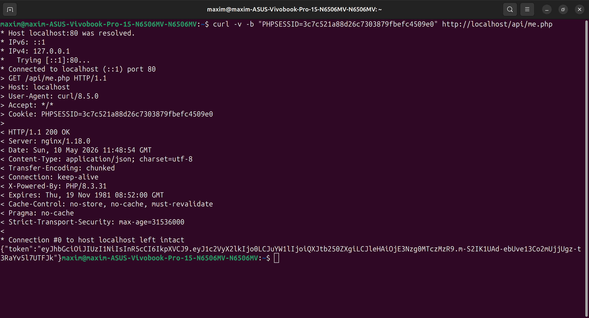

me.php использует session_start(), потому что пользователь уже прошёл логин через PHP-форму, и сервер
хранит факт авторизации в PHP-сессии. Логин и пароль повторно передавать не нужно: браузер отправляет
cookie PHPSESSID, PHP по ней находит серверную сессию и достаёт user_id. Cookie PHPSESSID играет роль
идентификатора сессии, а me.php по этой сессии выпускает JWT для запросов React к FastAPI.

## 3

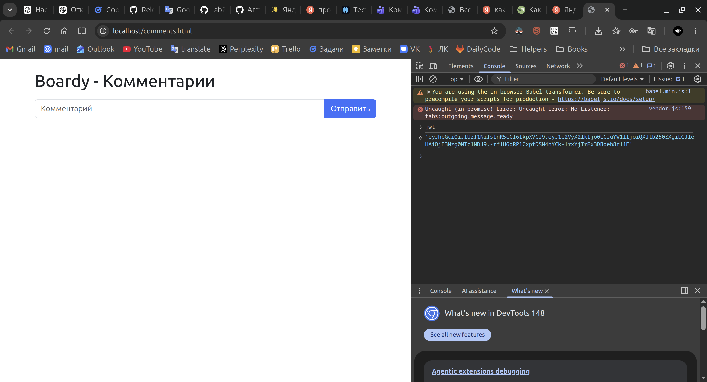

## 4

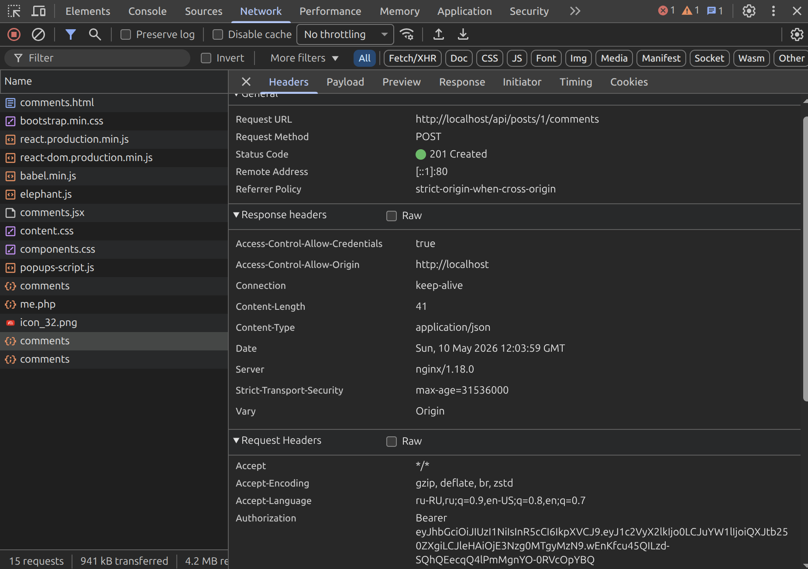
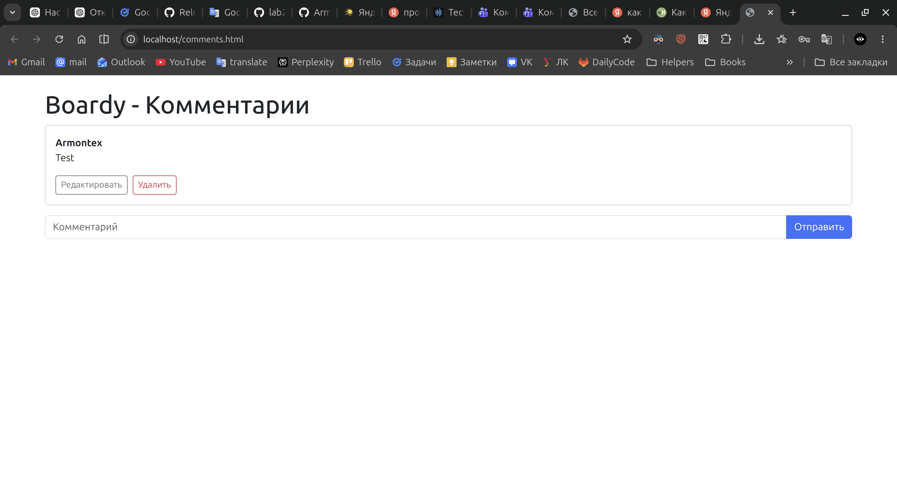

## 5

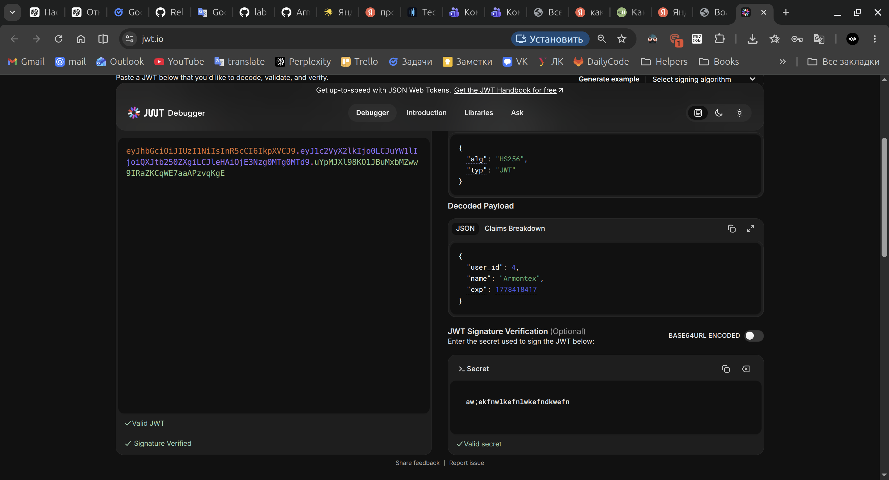

Payload JWT не зашифрован, а закодирован в Base64URL. Поэтому любой, кто получил токен, может прочитать
user_id, name и exp. Это не проблема, если в payload не класть секретные данные: пароль, хеш пароля,
email, приватные токены. Защита JWT не в скрытии payload, а в подписи: злоумышленник может прочитать
данные, но не может изменить их без знания secret key, иначе проверка подписи не пройдёт.

## 6

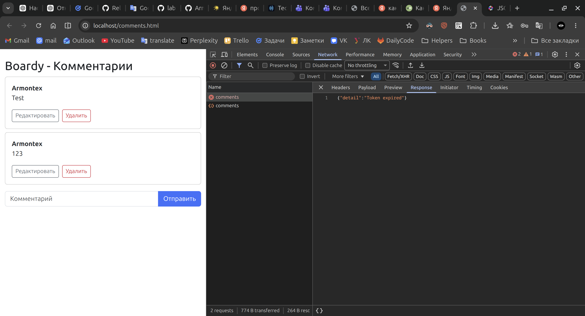

## 7

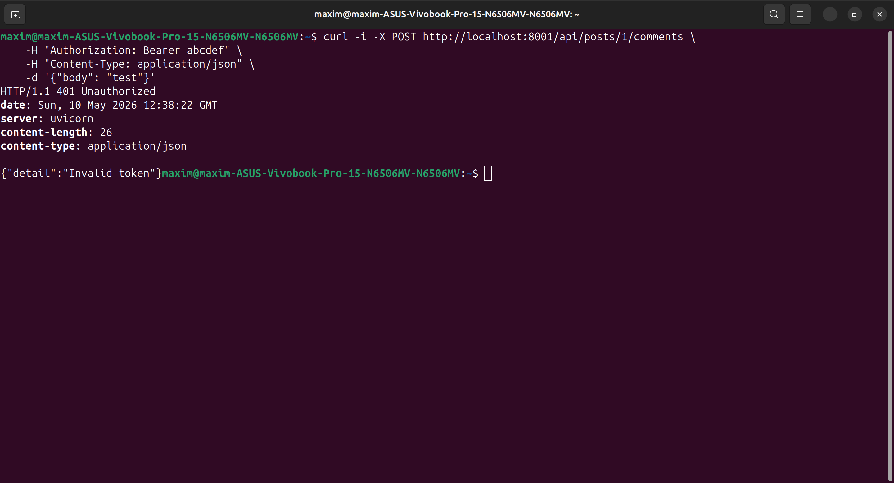

## 8

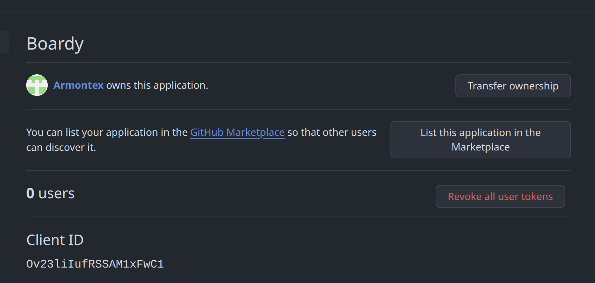

## 9

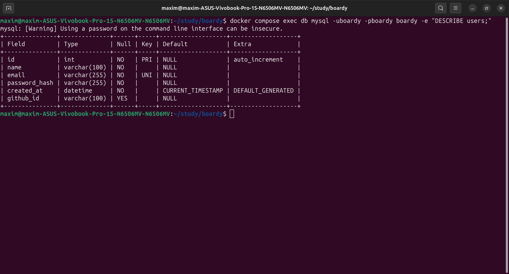

## 10

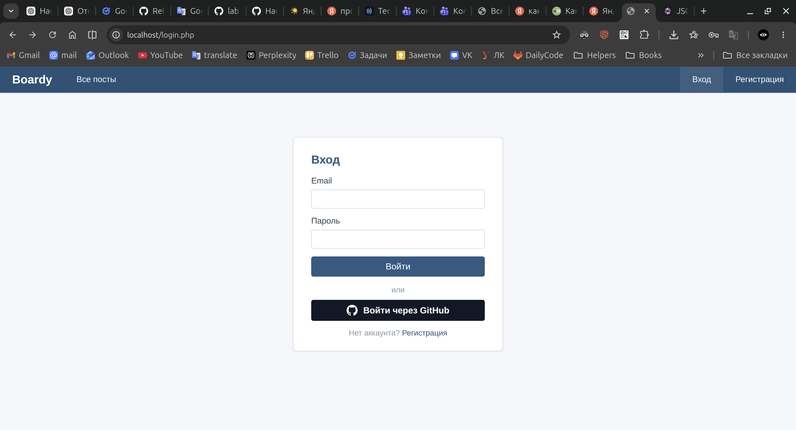

## 11

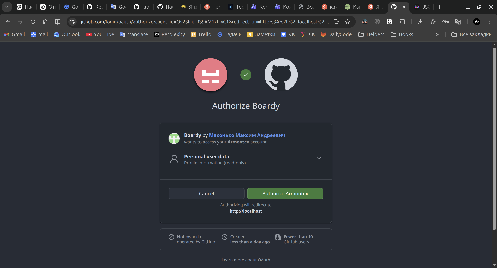
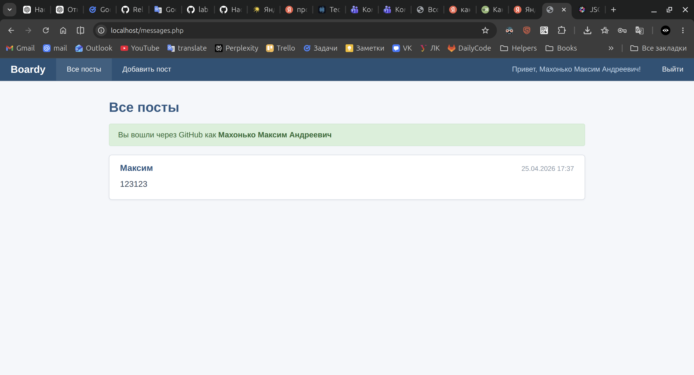

## 12

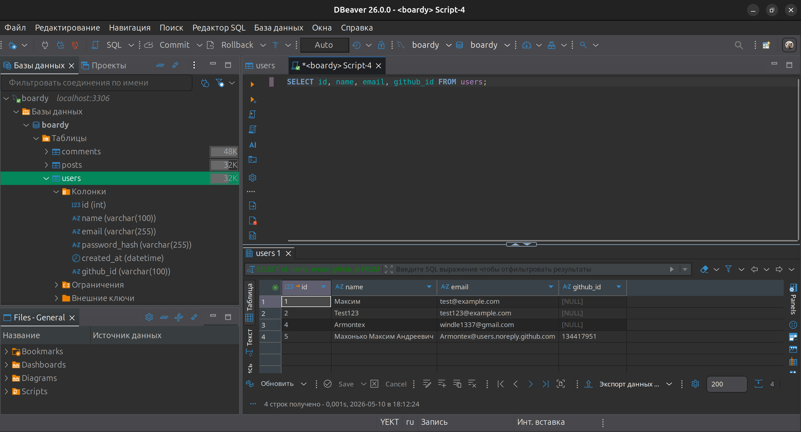

Идентификация OAuth-пользователя выполняется по `github_id`, потому что это стабильный уникальный
идентификатор аккаунта GitHub. Email использовать нельзя: пользователь может скрыть email, GitHub может
вернуть noreply-адрес, email может измениться, а также один и тот же email не всегда надёжно подтверждает
принадлежность OAuth-аккаунта. Поэтому `github_id` безопаснее использовать как внешний ключ к аккаунту
GitHub.

## 13

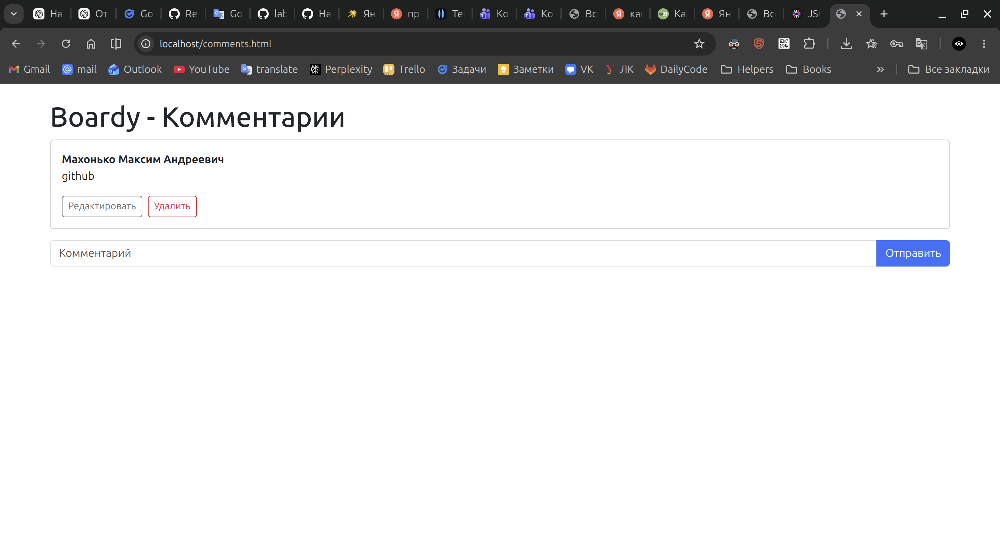

1. Пользователь нажимает кнопку «Войти через GitHub».
2. `oauth-github.php` создаёт параметр `state`, сохраняет его в PHP-сессию и перенаправляет пользователя
   на GitHub.
3. GitHub после авторизации возвращает пользователя на `oauth-callback.php` с параметрами `code` и
   `state`.
4. `oauth-callback.php` проверяет `state`, обменивает `code` на access token и получает профиль GitHub-
   пользователя.
5. Пользователь ищется в таблице `users` по `github_id`. Если записи нет, она создаётся.
6. В PHP-сессию записываются `user_id` и `user_name`.
7. `comments.html` загружает React-приложение.
8. React отправляет запрос на `/api/me.php`.
9. `me.php` читает PHP-сессию и создаёт JWT с `user_id`, `name` и `exp`.
10. React сохраняет JWT и при создании комментария отправляет запрос в FastAPI с заголовком
    `Authorization: Bearer <token>`.
11. FastAPI проверяет JWT, берёт `user_id` из payload и создаёт комментарий от имени этого пользователя.

## 14

`state` — случайная строка, которую приложение создаёт перед OAuth-входом и сохраняет в сессии. GitHub
возвращает её обратно в callback, а приложение сравнивает полученное значение с сохранённым. Если значения
не совпадают, вход отклоняется.

Без `state` возможна CSRF-атака:

1. Злоумышленник начинает OAuth-вход через свой GitHub.
2. Получает callback-ссылку с `code`.
3. Передаёт эту ссылку жертве.
4. Жертва открывает ссылку в своей сессии Boardy.
5. Приложение принимает чужой `code`.
6. Сессия жертвы привязывается к GitHub-аккаунту злоумышленника.

`state` предотвращает это, потому что чужой callback не совпадёт со значением в сессии жертвы.

## 15

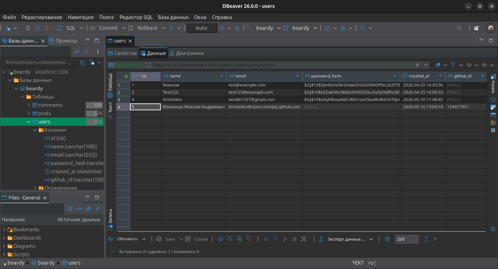

## 16

| Вопрос                     | Куки+сессии                                                                         | JWT                                                                 | OAuth                                                                                                           |
| -------------------------- | ----------------------------------------------------------------------------------- | ------------------------------------------------------------------- | --------------------------------------------------------------------------------------------------------------- |
| Где хранятся данные?       | Основные данные сессии хранятся на сервере. В браузере хранится только `PHPSESSID`. | Данные пользователя и срок действия хранятся внутри токена.         | Данные аккаунта хранятся у внешнего провайдера, например GitHub. В приложении хранится связь через `github_id`. |
| Кто прикрепляет к запросу? | Браузер автоматически отправляет cookie.                                            | Клиентский код добавляет заголовок `Authorization: Bearer <token>`. | Пользователь проходит авторизацию у провайдера. После callback приложение создаёт свою сессию или токен.        |
| Для какого типа клиентов?  | Обычные серверные сайты.                                                            | API, SPA и мобильные приложения.                                    | Вход через внешний аккаунт без хранения пароля в приложении.                                                    |
| Можно ли отозвать?         | Да, сервер может удалить сессию.                                                    | Сложнее: токен действует до `exp`, если не вести blacklist.         | Да, можно удалить связь в приложении или отозвать доступ у провайдера.                                          |
| Кросс-доменно работает?    | Ограниченно. Зависит от настроек cookie, `SameSite`, CORS и HTTPS.                  | Да, при правильной настройке CORS.                                  | Да, OAuth рассчитан на работу между разными доменами.                                                           |

## 17

1. **Секрет JWT хранится в коде.**
   Если код попадёт в GitHub, секрет может утечь. После этого злоумышленник сможет подписывать
   свои JWT.
   **Решение:** Laravel Passport использует RSA-ключи, которые генерируются командой
   `passport:keys` и не должны попадать в git.

2. **Нет отзыва токенов.**
   Если пользователь заблокирован или токен украден, JWT всё равно будет работать до истечения
   `exp`.
   **Решение:** Laravel Passport хранит access tokens в базе и позволяет отзывать их.

3. **OAuth state проверяется вручную.**
   Если забыть проверить `state`, появится CSRF-уязвимость в OAuth flow.
   **Решение:** Laravel Socialite берёт генерацию и проверку `state` на себя.
