# Практика 13. WebSocket: реалтайм-лента

## Задание 1. ConnectionManager

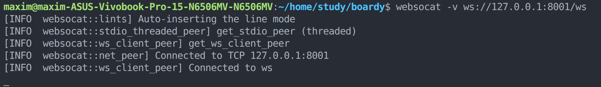

`self.active` — это список WebSocket-подключений в памяти процесса FastAPI. Его нельзя хранить в базе данных, потому что WebSocket — это живое сетевое соединение, а не обычные данные.

Если Uvicorn перезапустится, список `self.active` очистится, все WebSocket-соединения разорвутся, и клиенты должны подключиться заново.

## Задание 2. /internal/broadcast

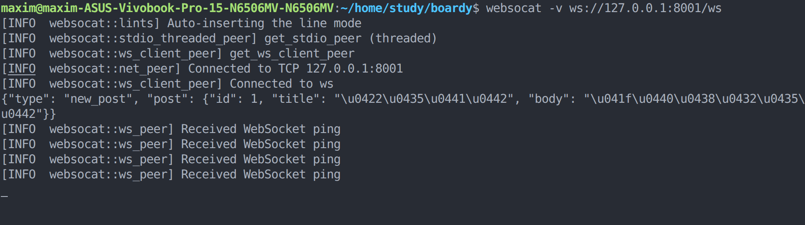

`/internal/broadcast` не требует JWT, потому что это внутренний endpoint для связи backend-сервисов: Laravel вызывает FastAPI, а не пользовательский браузер.

Риск в том, что если endpoint открыт наружу, любой сможет отправлять фейковые события в WebSocket-ленту. На VPS это закрывается в Nginx через `allow 127.0.0.1; deny all;`. В локальной Docker-среде endpoint используется как внутренний учебный callback.

## Задание 3. Два клиента

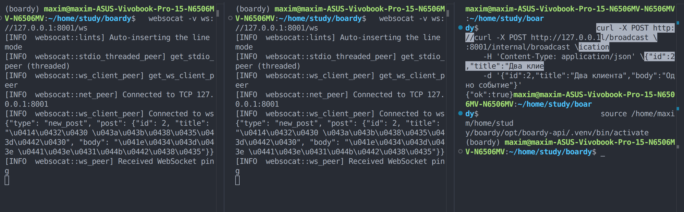

Если один клиент отключился во время broadcast, отправка в него вызовет исключение. В `broadcast()` такое соединение добавляется в `dead_connections`, а после рассылки удаляется из `self.active`.

Это обрабатывается в `routers/ws.py` внутри метода `ConnectionManager.broadcast()`.

## Задание 4. PostController

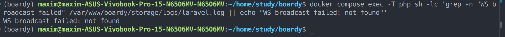

`timeout(2)` нужен, чтобы Laravel не зависал надолго, если FastAPI недоступен. Если timeout не указать, создание поста может ждать ответа слишком долго.

## Задание 5. Проверка callback

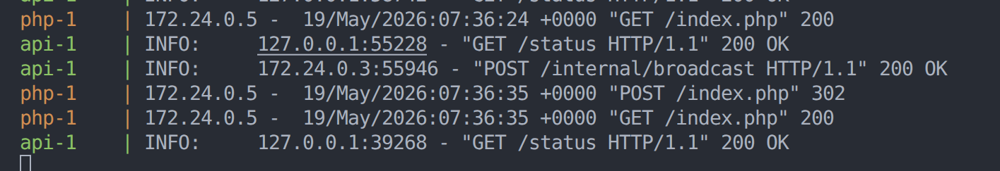

HTTP-callback — хрупкое решение: Laravel синхронно зависит от FastAPI, при недоступности FastAPI появляется задержка, а при нескольких экземплярах FastAPI событие попадёт только в один процесс с одним `ConnectionManager`.

## Задание 6. WebSocket в Blade

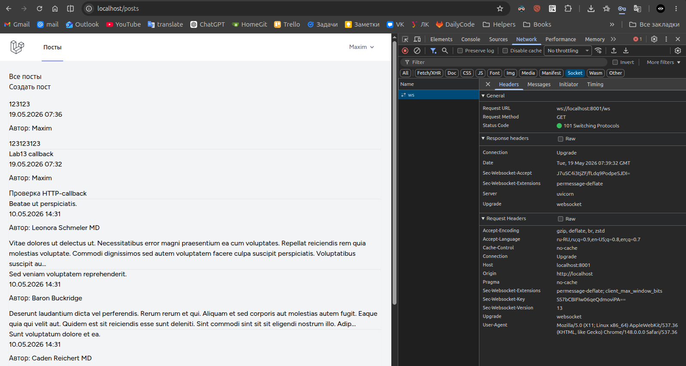

Локально используется `ws://`, потому что проект запущен без TLS. На проде с HTTPS нужен `wss://`, иначе браузер заблокирует небезопасное WebSocket-соединение. Если использовать `wss://` без TLS, соединение не установится.

## Задание 7. Два браузера

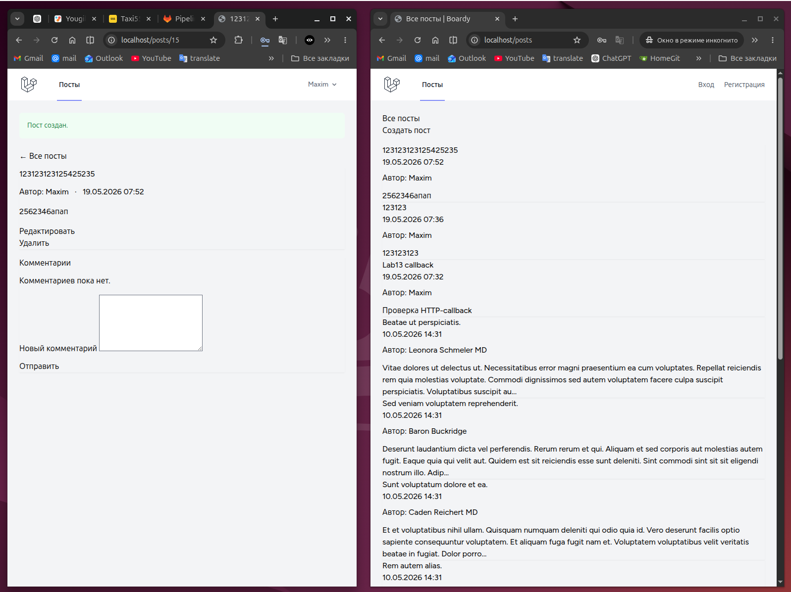

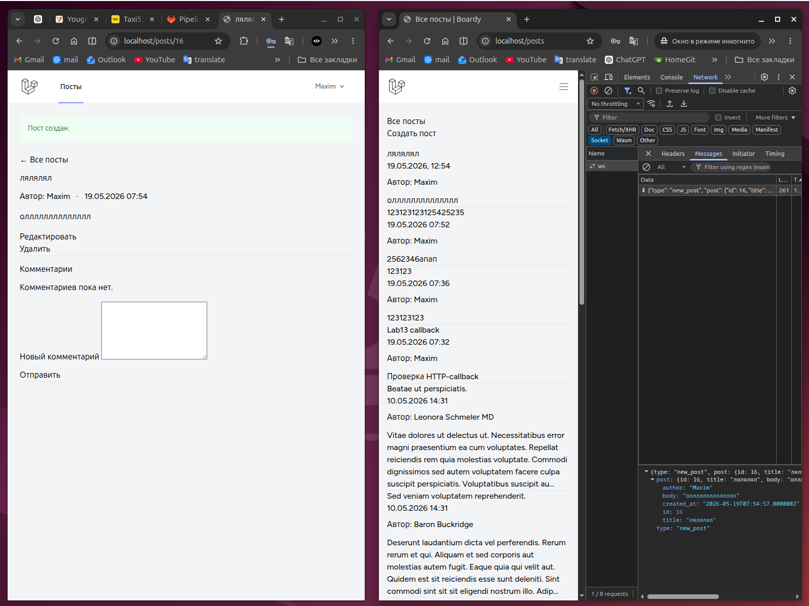

## Задание 8. XSS

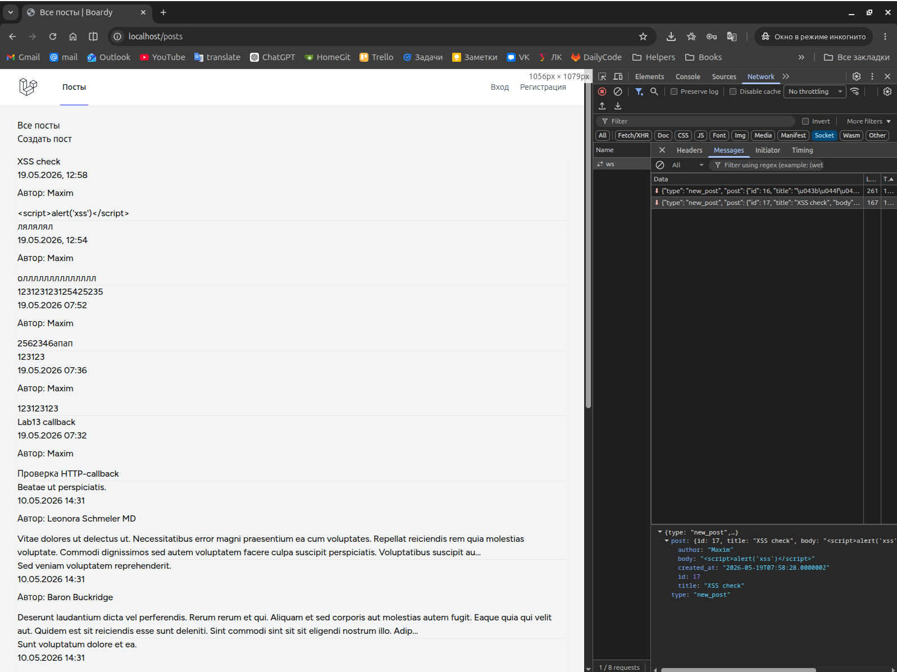

`escapeHtml()` превращает пользовательский ввод в безопасный текст перед вставкой в `innerHTML`. Если вставлять данные напрямую в `innerHTML`, браузер может выполнить HTML/JS из поста, например `<script>` или обработчики событий.

## Задание 9. Переподключение

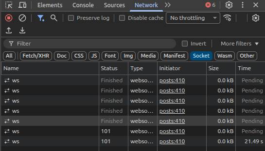

## Задание 10. WS-проксирование

[11](screenshots/11-nginx-ws.png)

Без `proxy_http_version 1.1` Nginx не сможет корректно проксировать WebSocket Upgrade. Без `proxy_set_header Upgrade` backend не получит запрос на переключение протокола. Без `proxy_read_timeout` долгое WebSocket-соединение может закрыться по таймауту.

## Задание 11. Закрыть /internal

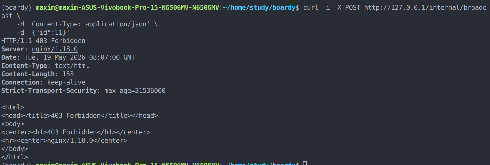

`/internal/broadcast` опасен без ограничения доступа: любой внешний пользователь мог бы вызвать его и отправить фейковые события в WebSocket-ленту. Поэтому внешний доступ через Nginx закрыт и возвращает `403 Forbidden`.
