# Report

## 1

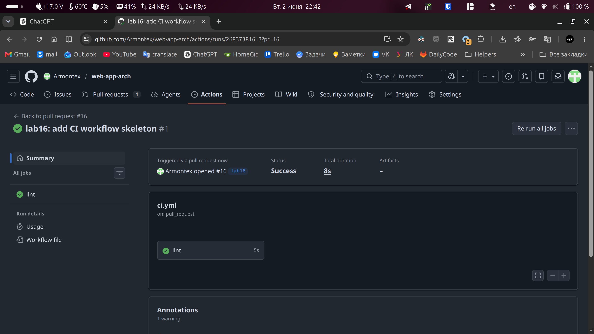

## 2

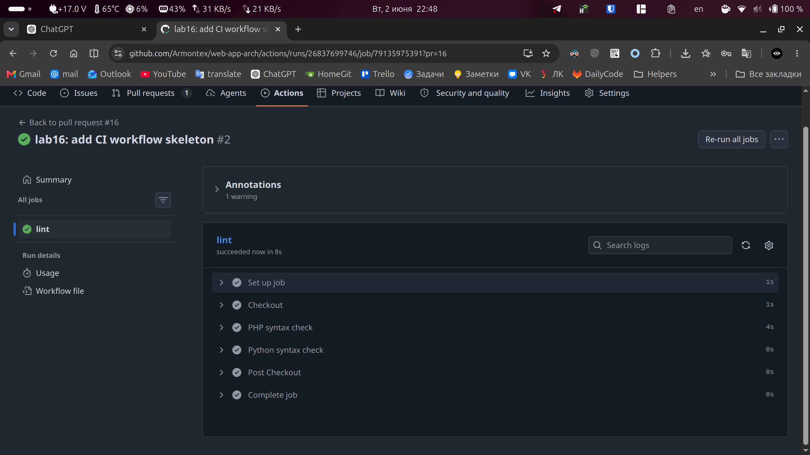

Lint стоит первым в пайплайне, потому что это быстрый fail-fast этап: он сразу отсекает код, который даже не
разбирается интерпретатором. Он ловит синтаксические ошибки PHP и Python, например незакрытые скобки,
неправильные конструкции языка и битые файлы. Но lint не проверяет бизнес-логику, работу с БД, HTTP-сценарии и
корректность поведения приложения.

## 3

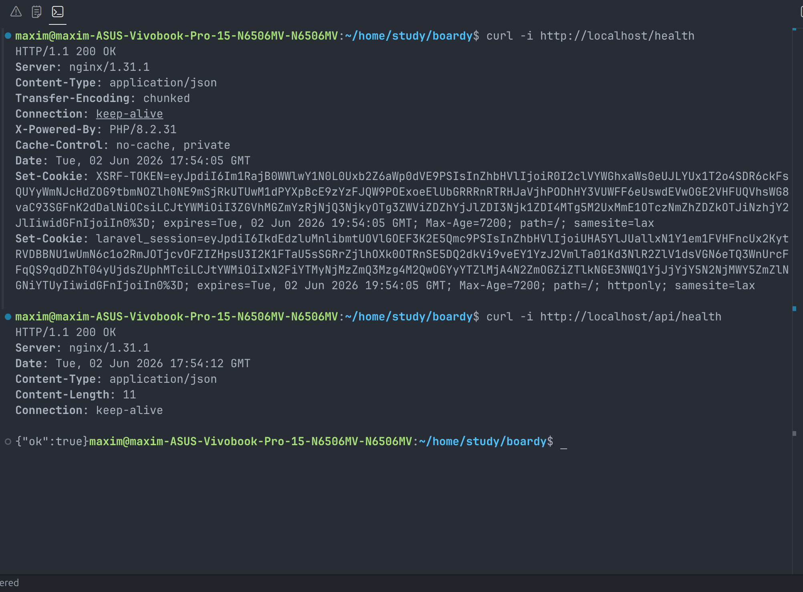

Отдельный /health нужен как простой endpoint без бизнес-логики, чтобы CI, балансировщик, Docker healthcheck или мониторинг могли быстро проверить, что сервис жив и отвечает. Полноценные endpoint-ы могут зависеть от
авторизации, БД или пользовательских данных, поэтому они хуже подходят для базовой проверки доступности. В проде такой паттерн используют в health-check-ах контейнеров, оркестраторов, балансировщиков и систем мониторинга.

## 4

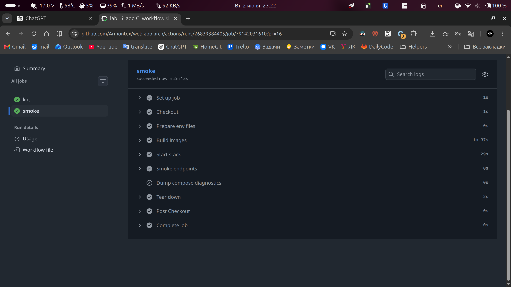

Smoke-check ловит три класса поломок: ошибки сборки Docker-образов, ошибки запуска compose-стека и ситуацию,
когда сервисы поднялись, но HTTP health endpoint-ы не отвечают. Он не ловит глубокие логические ошибки
приложения, ошибки бизнес-сценариев, проблемы производительности и баги, которые не проявляются на /health.

## 5

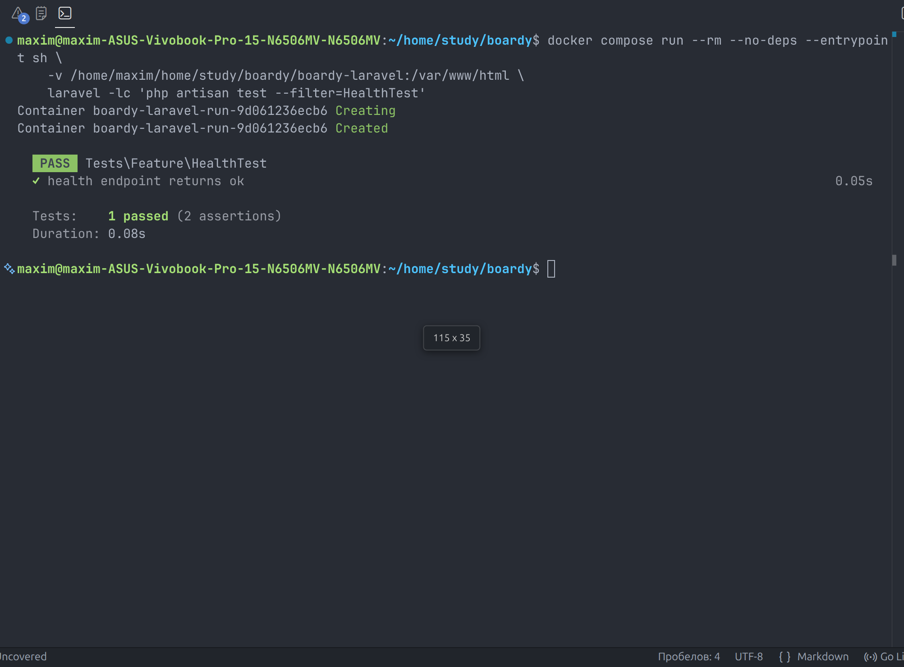

## 6

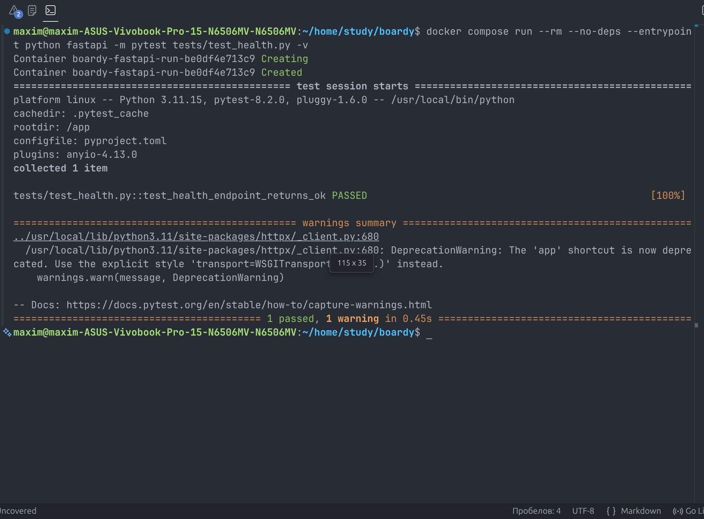

## 7

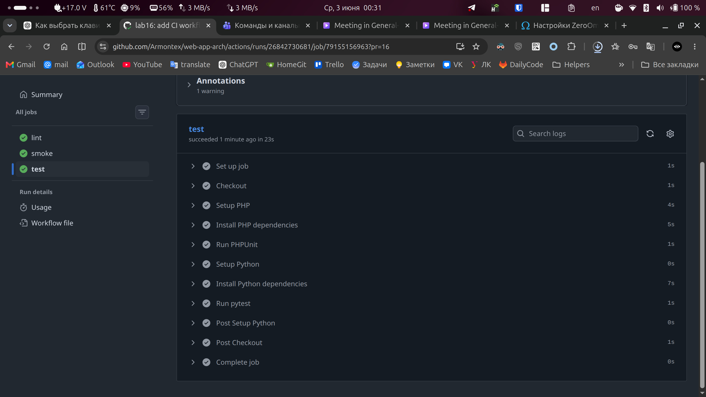

Job test стоит после smoke, потому что сначала нужно убедиться, что проект собирается, compose-стек стартует и
сервисы в целом отвечают. После этого имеет смысл запускать тестовые фреймворки. Если поставить test до smoke,
тесты могли бы пройти в изоляции, но пайплайн всё равно не заметил бы проблем сборки Docker-образов, compose-
конфигурации или запуска сервисов до следующего этапа.

## 8

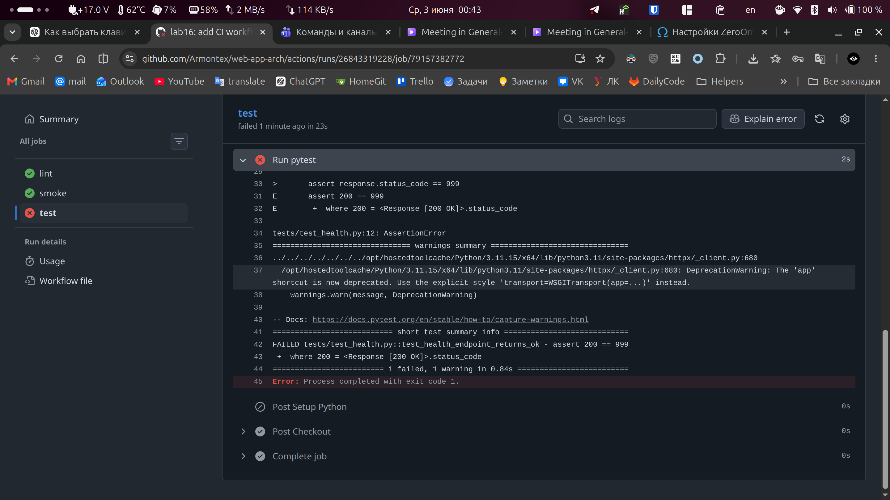
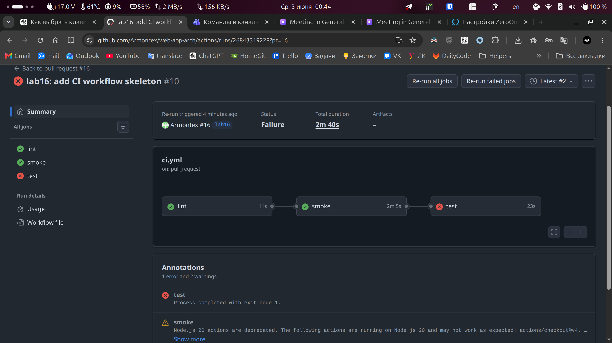
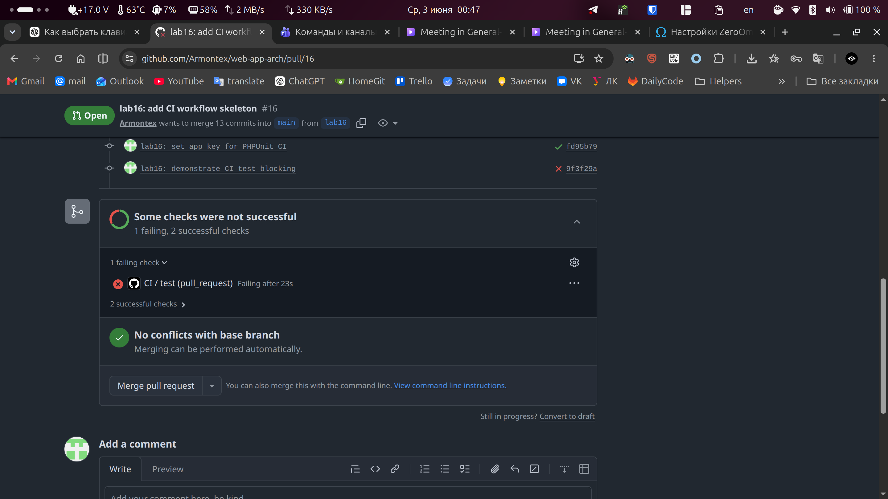

При ручном деплое сломанный тест мог бы быть не замечен: разработчик вручную запустил бы сборку, поднял
контейнеры и выкатил версию, в которой endpoint ведёт себя не так, как ожидается тестами. CI остановил цепочку на
этапе test, поэтому сборка и деплой не продолжаются, а проблема видна сразу в Pull Request. Это экономит время на
ручной проверке, откате и поиске причины уже после выката.

_На этом этапе PR показывает failed checks, но merge ещё не заблокирован, потому что защита ветки main с обязательными status checks включается в задании 10. После включения branch protection такой же провал test будет блокировать merge автоматически._

## 9

Чтобы открыть лог упавшего теста в GitHub Actions:

1. Открыть репозиторий на GitHub и перейти во вкладку Actions.
2. Выбрать последний запуск workflow CI, который завершился с красным статусом.
3. В левой колонке открыть job test.
4. Внутри job найти и раскрыть шаг Run pytest.
5. В выводе pytest найти строку с упавшим тестом tests/test_health.py::test_health_endpoint_returns_ok.
6. Ниже посмотреть конкретный assert, например assert 200 == 999, а также файл и строку, где произошла ошибка.

## 10

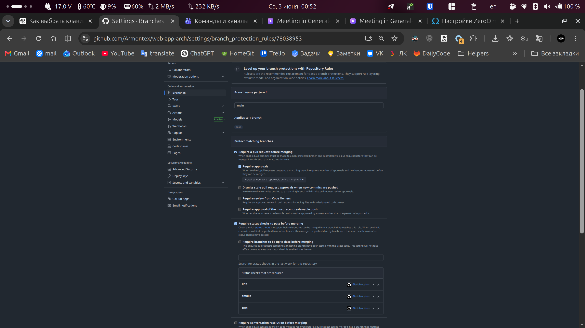

## 11

CI и deploy вынесены в разные workflow, потому что они запускаются по разным событиям и решают разные задачи. CI проверяет Pull Request до попадания кода в main, а deploy запускается только после push в main и отвечает за доставку версии. Повтор lint/smoke/test в deploy.yml нужен как дополнительная защита: даже если кто-то обойдёт PR-процесс или main изменится напрямую, деплой не начнётся без повторных проверок.

## 12

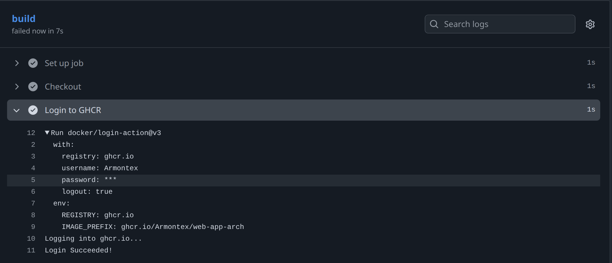

GITHUB_TOKEN — это автоматический токен GitHub Actions, который создаётся GitHub для каждого запуска workflow. Он
отличается от обычного secret-а тем, что его не нужно создавать вручную и он живёт только в рамках запуска
workflow. Также его права задаются явно через permissions в workflow, например packages: write для push в GHCR.
Обычный secret создаётся пользователем вручную, хранится в настройках репозитория и используется до тех пор, пока
его не удалить или не заменить.

## 13

Тег по SHA нужен для точной привязки Docker-образа к конкретному коммиту. По нему можно понять, из какой версии
кода собран образ, и откатиться на эту версию. Тег latest нужен как удобная ссылка на самую свежую успешную
сборку, его удобно использовать в compose для обычного обновления.

Скриншот GHCR Packages не приложен, так как в учебной локальной среде нет полноценного production-деплоя через
реальный VPS. Workflow сборки и push образов оформлен в deploy.yml.

## 14

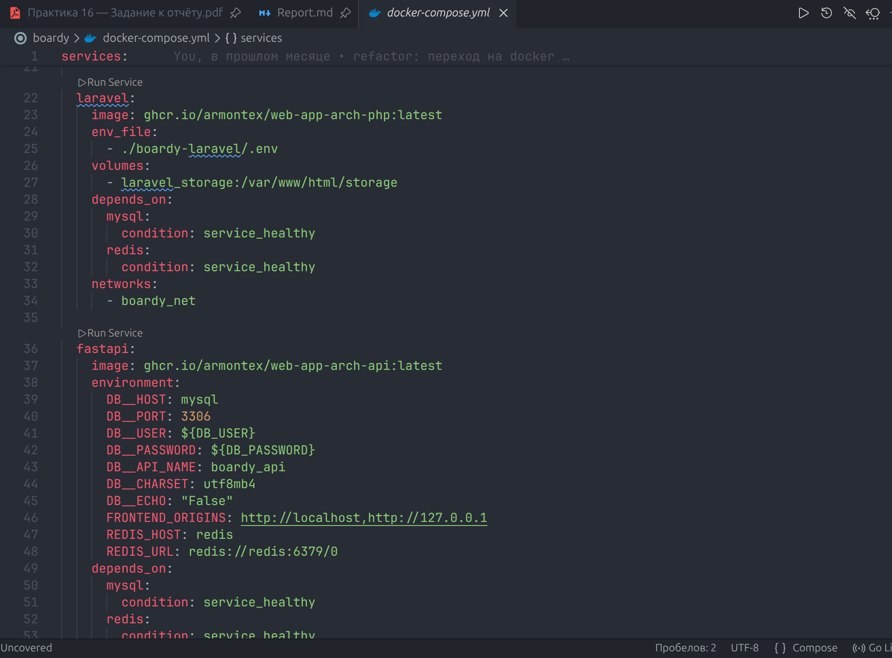

В практике 14 сервер сам собирал образы через build из исходников. В практике 16 сборка переносится в CI: GitHub
Actions собирает Docker-образы и публикует их в GHCR, а сервер только скачивает готовые image и запускает
контейнеры. Это уменьшает нагрузку на сервер, делает деплой быстрее и связывает каждую версию образа с конкретным
коммитом.

## 15

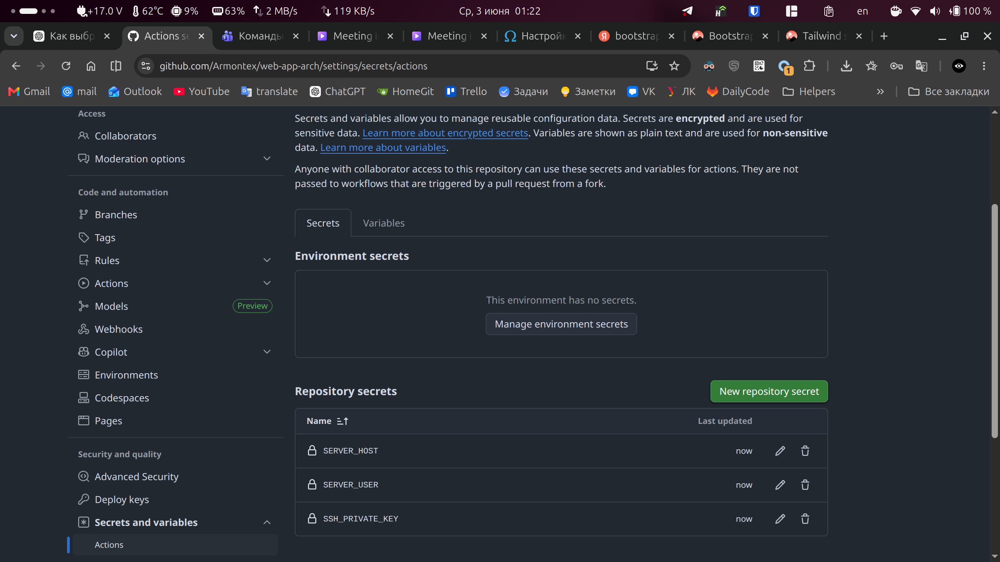

Для деплоя используется отдельный SSH-ключ, а не личный ключ разработчика, потому что его права и назначение
ограничены только автоматическим деплоем. Если такой ключ утечёт, его можно быстро удалить из authorized_keys на
сервере и заменить secret в GitHub, не меняя личные доступы разработчика. Приватная часть ключа хранится только в
GitHub Secrets, а публичная часть добавляется на сервер.

## 16

Job deploy добавлен по методичке через appleboy/ssh-action и выполняет pull, up -d и prune на удалённом сервере.
В учебной локальной среде реального VPS нет, поэтому фактический SSH-деплой не выполнялся: SERVER_HOST=127.0.0.1
внутри GitHub Actions указывает на runner, а не на локальный компьютер. В проекте деплой оформлен как готовый
workflow-шаблон для сервера с Docker.

## 17

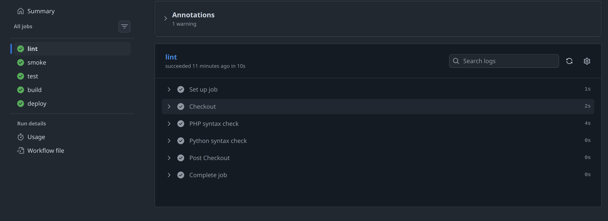

Скриншот обновлённого production-сайта не приложен, так как проект выполнялся в локальной Docker-среде без
реального VPS и публичного production-хоста.

## 18

Откат выполняется через SHA-тег Docker-образа. Нужно выбрать предыдущий успешный SHA в GHCR и на сервере временно
указать его вместо latest.

Пример команд на сервере:

```bash
docker login ghcr.io
cd /opt/boardy

# заменить latest на нужный SHA в docker-compose.yml
# например:
# ghcr.io/armontex/web-app-arch-php:<OLD_SHA>
# ghcr.io/armontex/web-app-arch-api:<OLD_SHA>

docker compose pull
docker compose up -d
docker image prune -f
```

Пересобирать ничего не нужно, потому что образ с нужной версией уже собран CI и хранится в GHCR. Сервер только
скачивает готовый образ по тегу SHA и перезапускает контейнеры.

## 19

1. Версию стороннего action лучше пинить по SHA, потому что тег может быть изменён владельцем action. SHA
   указывает на конкретный коммит и защищает пайплайн от неожиданного изменения кода action.

2. pull_request_target опасен для недоверенного кода, потому что workflow выполняется в контексте базового
   репозитория и может получить доступ к secrets. Если запустить там код из чужого PR, злоумышленник может
   попытаться вывести secrets или выполнить вредные команды.

3. Self-hosted runner опасен для публичного репозитория, потому что недоверенный PR-код может выполняться на
   вашей машине или сервере. Это создаёт риск кражи файлов, ключей, токенов, доступа к Docker socket и внутренней
   сети.

## 20

Практика 1: Linux CLI решил боль ручной работы с файлами и командами через базовую навигацию, просмотр логов и
управление процессами.

Практика 2: SSH, VPS и Git решили боль удалённой работы с сервером и доставки кода через репозиторий.

Практика 3: Nginx и DNS решили боль доступа к приложению через нормальный HTTP-вход вместо прямого обращения к
внутренним портам.

Практика 4: HTTP решил боль понимания клиент-серверного обмена: методы, заголовки, статусы и тело запроса.

Практика 5: HTTPS решил боль безопасной передачи данных между клиентом и сервером.

Практика 6: CGI показал базовый принцип динамического backend-ответа на HTTP-запрос.

Практика 7: PHP-FPM и FastAPI решили боль разделения frontend/backend-обработки и запуска разных backend-сервисов
за nginx.

Практика 8: MySQL решил боль постоянного хранения пользователей, постов и комментариев.

Практика 9: REST API, SSR и CSR решили боль выбора формата взаимодействия между страницами, JavaScript и backend
API.

Практика 10: Cookies и sessions решили боль сохранения состояния пользователя между HTTP-запросами.

Практика 11: JWT и OAuth решили боль авторизации API-запросов и выдачи access-токенов.

Практика 12: Laravel решил боль быстрой разработки полноценного web-приложения с роутингом, шаблонами, моделями и
авторизацией.

Практика 13: WebSocket решил боль real-time обновлений без постоянного polling со стороны клиента.

Практика 14: Redis решил боль обмена событиями между Laravel и FastAPI, а также поддержки pub/sub для realtime-
сценариев.

Практика 15: Docker решил боль одинакового запуска всего проекта в одном окружении: nginx, Laravel, FastAPI,
MySQL и Redis поднимаются одной командой.
