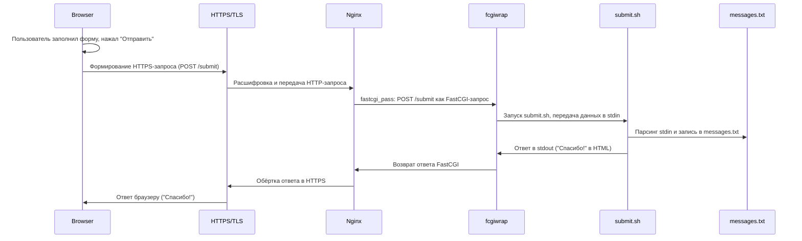

# Report 6

## 1

## 2

## 3

- `fastcgi_pass` - директива, которая говорит nginx, куда отправлять запросы из этого location. В нашем случае на unix-сокет, из которого уже будет читать процесс fcgiwrap
- `include fastcgi_params`- то, какие переменные окружения будут переданы в бэкенд
- `fastcgi_param SCRIPT_FILENAME /var/www/boardy$fastcgi_script_name` - в fcgiwrap будет передаваться полный путь к скрипту. `$fastcgi_script_name` - uri, про который знает nginx. `/var/www/boardy$fastcgi_script_name` - полный путь к скрипту для fcgiwrap

## 4

## 5

## 6

## 7

## 8

## 9

## 10

1. CGI - Common Gateway Interface, решил проблему динамичных страниц, ранее были только статичные
2. Через stdin
3. Потому что на каждый запрос поднимается процесс, а это дорого по ресурсам и времени
4. fastcgi_pass - мы передаём данные через специальный FastCGI протокол так сказать, а при proxy_pass мы просто передаёт всё, что получили на другой порт/сервер.
5. Потому что Apache не подходит для сильно-нагруженных серверов, а Nginx - да, вот только Nginx не умеет запускать CGI напрямую, поэтому нужен fcgiwrap
